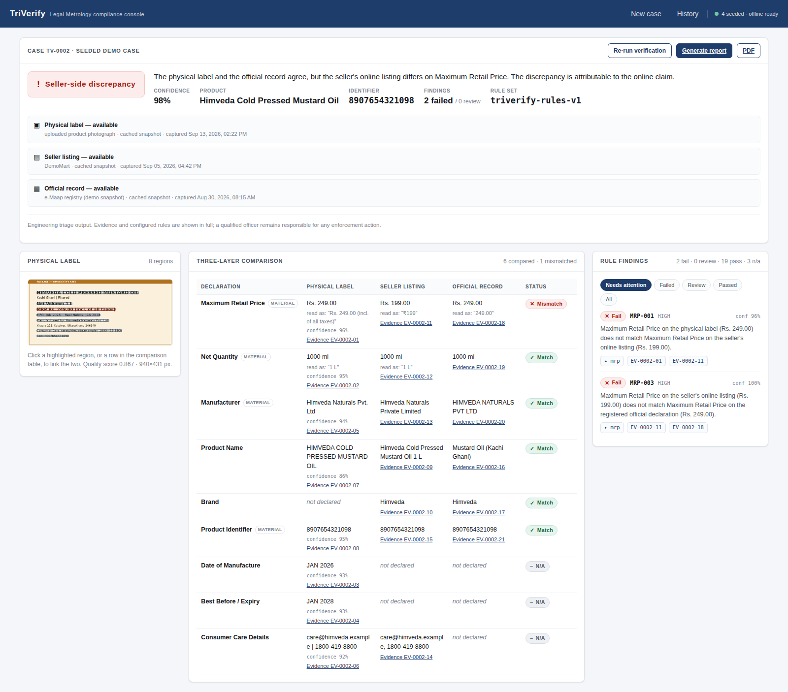
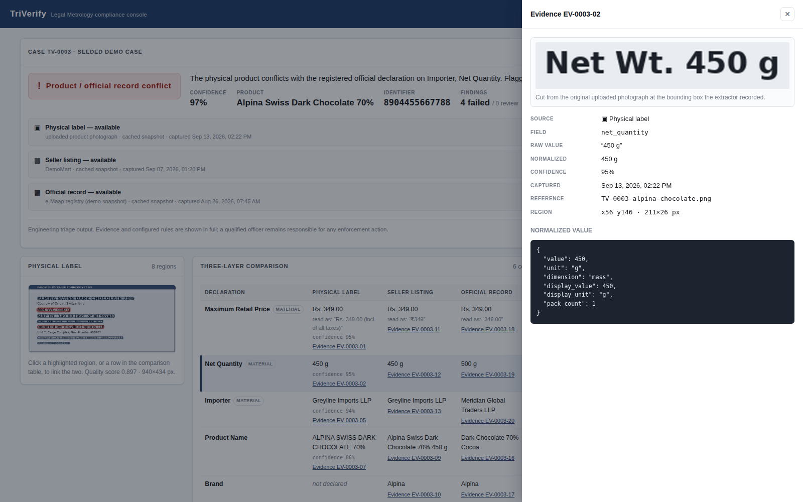

# PARAKH

**Three-layer Legal Metrology compliance scanner** — SIH 2026, problem statement SIH26034.

PARAKH takes a photograph of a packaged commodity, extracts the legally
required declarations, and reconciles them against **two independent surfaces**:
the seller's e-commerce listing and the registered official declaration. It then
produces a traceable classification with the exact mismatches and the visual
evidence behind each one.

> *"Show me what is printed on the pack, what the seller claims online, what the
> official record says, and exactly why those three do or do not agree."*

**The differentiator is not OCR.** OCR only extracts. The compliance decision is
made by an explicit, deterministic rule set that a judge can read line by line,
and every finding points at a source field and an image crop.

---

## What it looks like



*Case TV-0002. The physical label and the official record both say Rs. 249; the
seller's listing says Rs. 199. One mismatch, one story, and the deterministic
rules that fired are listed on the right.*



*Clicking any value opens the evidence behind it: the exact crop of the
uploaded photograph, the normalized value, the extraction confidence, and the
raw source payload.*

---

## Quick start

The repository has two halves: **`backend/`** (FastAPI) and **`frontend/`**
(React). Each command below says which directory to run it from.

### Windows (PowerShell)

```powershell
# from the repository root (the folder holding backend/ and frontend/)
python -m venv .venv
.\.venv\Scripts\Activate.ps1
pip install -r backend\requirements-dev.txt
```

```powershell
# then from backend\
cd backend
python -m app.seed
python -m uvicorn app.main:app --host 127.0.0.1 --port 8000
```

Or the one-liner, **from the repository root**:

```powershell
powershell -ExecutionPolicy Bypass -File backend\scripts\demo.ps1
```

### macOS / Linux

```bash
# from the repository root
python3 -m venv .venv
source .venv/bin/activate
make demo          # or: pip install -r backend/requirements-dev.txt
```

Then open **<http://127.0.0.1:8000>**.

That is the whole demo. No Docker, no Postgres, no Node, no network. The React
dashboard is pre-built into `frontend/dist/` and FastAPI serves it from the same
port, so the backend alone gives you the full UI.

---

## Command reference

The virtualenv lives at the repository root (`.venv`); activate it there, then
change into the directory each command needs.

| What you want | Run it from | Command | `make` |
|---|---|---|---|
| Install Python deps | repo root | `pip install -r backend/requirements-dev.txt` | `make setup` |
| Install Node deps | `frontend/` | `npm install` | `make setup` |
| Load the 4 demo cases | `backend/` | `python -m app.seed` | `make seed` |
| Run all tests | `backend/` | `python -m pytest` | `make test` |
| Start API + dashboard | `backend/` | `python -m uvicorn app.main:app --reload --port 8000` | `make serve` |
| Frontend with hot reload | `frontend/` | `npm run dev` | `make web` |
| Rebuild the bundle | `frontend/` | `npm run build` | `make build` |
| Regenerate demo fixtures | `backend/` | `python scripts/make_demo_data.py` | `make fixtures` |
| Recoverable snapshot | `backend/` | `python scripts/snapshot.py` | `make snapshot` |
| Wipe and reseed | `backend/` | delete `triverify.db`, then `python -m app.seed` | `make reset` |

Every `make` target is run **from the repository root** and changes directory
for you.

### Working on the frontend

Two terminals, both starting at the repository root with `.venv` active:

```powershell
cd backend
python -m uvicorn app.main:app --reload --host 127.0.0.1 --port 8000
```

```powershell
cd frontend
npm run dev
```

Vite serves the dashboard on <http://localhost:5173> with hot reload and proxies
API calls to port 8000. When you are done, `npm run build` refreshes
`frontend/dist/` so the single-port demo picks up your changes.

> **`make` is entirely optional** — every target above has a plain command next
> to it. If you do want it, the Makefile ships as `Makefile.txt` (the
> file-transfer bridge treats the bare name `Makefile` as protected). Rename it
> **from the repository root**:
>
> ```powershell
> Rename-Item Makefile.txt Makefile
> ```

---

## Python versions and dependencies

Verified end-to-end on **CPython 3.11, 3.12, 3.13 and 3.14**, on Windows and
Linux. Every pinned package resolves to a binary wheel on all four, so no
compiler is ever required.

`backend/requirements-dev.txt` deliberately omits the Postgres driver — local
development, the tests and the offline demo all run on SQLite. The three
deployment tests that build a Postgres engine skip themselves with an
explanatory message, so a clean install reports **147 passed, 3 skipped**.
Install the driver if you want the full 150:

```powershell
# from the repository root, with the venv active
pip install "psycopg[binary]==3.3.5"
```

`backend/requirements.txt` (used by Render) does include it.

### If `pip install` fails

pip resolves *every* requirement before installing *any* of them, so a single
package with no wheel for your Python aborts the whole install — and you end up
with nothing installed, not just the one package missing. If you see
`Could not find a version that satisfies the requirement <pkg>==<version>`,
check your interpreter first, **from the repository root**:

```powershell
python -V
```

Then confirm wheel availability for that version before changing a pin:

```powershell
pip download -r backend\requirements.txt --only-binary=:all: --python-version 3.14 --platform win_amd64 -d wheelcheck
```

That command reports a spurious failure for `uvloop`: pip cannot evaluate the
`sys_platform != "win32"` marker in cross-platform download mode. Real Windows
installs skip `uvloop` correctly — it is a Linux/macOS-only optional extra of
`uvicorn[standard]`.

---

## Repository layout

```
Sih/
├── backend/                     FastAPI service — everything Python
│   ├── app/
│   │   ├── main.py              app, health, /rules, static SPA hosting
│   │   ├── seed.py              loads the four golden cases
│   │   ├── core/
│   │   │   ├── config.py        every setting, environment-driven
│   │   │   └── database.py      engine + session (SQLite / Supabase)
│   │   ├── models/              SQLAlchemy ORM — FROZEN data contract
│   │   │   ├── base.py          declarative base
│   │   │   ├── case.py          cases, products, images, reports
│   │   │   ├── source.py        listing + official snapshots and fields
│   │   │   ├── evidence.py      OCR observations and evidence
│   │   │   ├── rule.py          rules and rule results
│   │   │   └── schema.sql       reference DDL (generated)
│   │   ├── schemas/
│   │   │   └── case.py          Pydantic — FROZEN API response contract
│   │   ├── routers/             thin FastAPI endpoints
│   │   │   ├── cases.py         create / read / verify / list / images
│   │   │   ├── evidence.py      evidence detail + on-demand crops
│   │   │   └── reports.py       report routes
│   │   ├── services/
│   │   │   ├── case_service.py  ingest → sources → reconcile → persist
│   │   │   ├── presenter.py     builds the frozen response shape
│   │   │   └── report_builder.py HTML and PDF rendering
│   │   ├── engine/              deterministic core (no I/O, no models)
│   │   │   ├── vocabulary.py    canonical fields and states — FROZEN
│   │   │   ├── compare.py       value equality with explicit tolerances
│   │   │   ├── rules.py         the rule set, as data
│   │   │   ├── reconcile.py     pairwise matrix + triangulation
│   │   │   └── classify.py      classification policy metadata
│   │   └── pipeline/            extraction
│   │       ├── preprocess.py    decode, correct, quality score, crops
│   │       ├── ocr.py           pluggable OCR (fixture / Tesseract)
│   │       ├── extract.py       label-anchored declaration extraction
│   │       ├── normalize.py     money, quantity, date, name, identifier
│   │       └── adapters/        e-commerce + official record snapshots
│   ├── data/                    images, OCR fixtures, cached snapshots,
│   │                            golden cases
│   ├── tests/                   unit, rules, API, golden cases, offline
│   ├── scripts/                 demo data, schema dump, snapshot, demo.ps1
│   ├── reports/                 generated report output
│   ├── requirements.txt         production deps (used by Render)
│   ├── requirements-dev.txt     local deps (no Postgres driver)
│   ├── pytest.ini
│   └── Dockerfile
├── frontend/                    React dashboard (Vite)
│   ├── src/
│   │   ├── main.jsx             entry point
│   │   ├── App.jsx              shell + hash router
│   │   ├── api.js               API client
│   │   ├── shared.js            display helpers
│   │   ├── styles.css
│   │   ├── pages/               IntakePage, CasePage, HistoryPage
│   │   ├── components/          VerdictPanel, LabelViewer,
│   │   │                        ComparisonTable, FindingsPanel,
│   │   │                        EvidenceDrawer, Badge
│   │   └── fixtures/            captured API response for UI-only dev
│   ├── dist/                    prebuilt bundle (committed on purpose)
│   ├── package.json
│   ├── vite.config.js
│   └── vercel.json
├── docker-compose.yml           local Postgres + API
├── render.yaml                  Render blueprint (rootDir: backend)
└── README.md
```

Nothing in `backend/` renders the dashboard. FastAPI serves the compiled files
in `frontend/dist/` as static assets so the demo runs from one process; the UI
itself is entirely React. The one place Python does emit HTML is
`app/services/report_builder.py`, which produces the downloadable case report
(and its PDF twin) — deliberately server-side so both formats come from one
code path.

---

## The four golden cases

The cases used in the demo **are** the automated tests, so the demo data is a
safety net rather than disposable mock content.

| Case | Scenario | Expected result |
|---|---|---|
| `TV-0001` | All three sources agree | `COMPLIANT` |
| `TV-0002` | Pack and registry say ₹249, listing says ₹199 | `SELLER_FRAUD` |
| `TV-0003` | Pack + listing say 450 g under one importer; registry says 500 g under another | `COUNTERFEIT_OR_ILLEGAL_IMPORT` |
| `TV-0004` | MRP line is blurred below threshold **and** no registered record exists | `MANUAL_REVIEW` |

Each is defined by one file in `backend/data/fixtures/golden_cases/`. That file is the
single source of truth: `backend/scripts/make_demo_data.py` renders the label image from
it and derives the OCR fixture from the exact pixel rectangles the text was
drawn into — so the image and its fixture can never drift apart.

---

## How the decision is made

1. **Extract.** OCR produces lines; a label-anchored parser turns them into
   `field / raw value / bbox / confidence` tuples. It handles multi-field lines
   such as `MFG: DEC 2025   EXP: DEC 2026` correctly.
2. **Normalize.** `1 kg` and `1000 g` become the same value; `₹99`, `Rs. 99.00/-`
   and `MRP 99` become the same value; `DEC 2025` and `01/12/2025` compare equal
   at month precision. A value that cannot be parsed returns `None` — never a
   guess.
3. **Compare.** Every comparison returns `EQUAL`, `DIFFERENT` or
   `INCOMPARABLE`. Never a bare boolean. `500 g` vs `500 ml` is `INCOMPARABLE`,
   not a mismatch and certainly not a match.
4. **Apply rules.** Presence rules check mandatory declarations on the pack;
   cross-source rules compare each layer pair; consistency rules sanity-check the
   label against itself. Each yields `PASS` / `FAIL` / `REVIEW` / `NOT_APPLICABLE`.
5. **Triangulate.** For each material field, work out which surface is the odd
   one out:

   | Pattern | Reading |
   |---|---|
   | photo = official, listing differs | the online claim is the outlier → seller-side |
   | photo = listing, both differ from official | the product as sold does not match the registry |
   | listing = official, photo differs | the physical item is the outlier |
   | all three differ | no single story fits → review |

6. **Classify.** Conflicting or ambiguous signals, any confident failure with no
   directional pattern, any missing source, and any unresolved material check all
   route to `MANUAL_REVIEW`. Only a case with no failures and no unresolved
   evidence can be `COMPLIANT`.

### Non-negotiables, enforced in code

- **Unknown is never compliant.** A missing official record, an unreadable label
  or a low-confidence field produces `REVIEW`, never a silent pass. Tested in
  `backend/tests/test_rules.py::TestMissingSources`.
- **A wrong value that looks right is worse than no value.** Garbled OCR such as
  `Rs. 4Z9.OO` is rejected outright rather than parsed as a confident `Rs. 4.00`.
- **Every failure carries evidence.** Asserted in
  `backend/tests/test_golden_cases.py::TestSellerFraudCase::test_every_failure_carries_evidence`.
- **The demo never needs the network.** `backend/tests/test_offline.py` physically
  breaks outbound sockets, then drives upload, verification, evidence, crops and
  report generation.

---

## API

| Method | Endpoint | Purpose |
|---|---|---|
| `POST` | `/cases` | Create a case from an uploaded image + identifier |
| `GET` | `/cases` | Inspection history and search (`?q=`, `?classification=`) |
| `GET` | `/cases/{case_id}` | Complete result: comparisons, findings, evidence |
| `POST` | `/cases/{case_id}/verify` | Re-run deterministic verification |
| `GET` | `/cases/{case_id}/evidence/{evidence_id}` | Provenance for one value |
| `GET` | `/cases/{case_id}/evidence/{evidence_id}/crop` | PNG crop of the label region |
| `GET` | `/cases/{case_id}/images/{image_id}` | Stored original / preprocessed image |
| `GET` | `/cases/{case_id}/report` | Report (`?format=html\|pdf\|json`) |
| `GET` | `/health` | Health, OCR engine, seeded-case count, offline readiness |
| `GET` | `/rules` | The full configured rule set |
| `GET` | `/classifications` | Classification policy |

Interactive docs at `/docs`. The frozen response shape lives in
`backend/app/schemas/case.py`; a captured example is at
`frontend/src/fixtures/sample-case.json`.

---

## OCR

OCR is pluggable, and **fixtures always win**:

- **Fixture engine** (default) — committed OCR output keyed by the image's
  content hash. Deterministic, offline, and what the golden cases and CI use.
- **Tesseract** — used automatically for images with no committed fixture, *if*
  `pytesseract` and the Tesseract binary are installed.

If neither is available the case is created anyway, the photo layer is marked
unavailable with a reason, and the result is `MANUAL_REVIEW`. It never crashes.

**For the live demo, upload one of the images in `backend/data/images/`.** Those have
committed fixtures, so extraction is identical on every machine with no
Tesseract install required.

To enable real OCR for arbitrary photos:

```powershell
# from the repository root, with the venv active
pip install pytesseract
```

…and install the Tesseract binary itself (Windows builds:
<https://github.com/UB-Mannheim/tesseract/wiki>; `brew install tesseract` on
macOS; `apt install tesseract-ocr` on Debian/Ubuntu).

---

## Deployment — Vercel + Render + Supabase

### 1. Supabase (database)

Create a project, then copy **Project Settings → Database → Connection string →
URI**. Prefer the **connection pooler** URI (port `6543`).

`backend/app/core/database.py` handles the Supabase specifics automatically: it rewrites
`postgresql://` to `postgresql+psycopg://`, adds `sslmode=require`, and — when it
detects the transaction-mode pooler on port 6543 — switches to `NullPool` and
disables psycopg's prepared-statement cache. Without that last part you get
intermittent `DuplicatePreparedStatement` errors under load.

Tables are created automatically on first boot. `backend/app/models/schema.sql` is the
reference DDL if you would rather apply it by hand.

### 2. Render (backend)

Create a **Blueprint** from this repository — `render.yaml` is already set up —
or a Web Service with:

- **Root directory:** `backend`
- **Build command:** `pip install -r requirements.txt`
- **Start command:** `uvicorn app.main:app --host 0.0.0.0 --port $PORT`
- **Health check path:** `/health`

Set these environment variables in the Render dashboard:

| Variable | Value |
|---|---|
| `DATABASE_URL` | the Supabase pooler URI |
| `TRIVERIFY_CORS_ORIGINS` | your Vercel URL, e.g. `https://triverify.vercel.app` |
| `TRIVERIFY_LIVE_SOURCES` | `0` |

To load the demo cases on the deployed instance, run this once in the Render
shell, **from `/opt/render/project/src/backend`**:

```bash
python -m app.seed
```

> **Note on Render's filesystem.** It is ephemeral, so PARAKH stores image
> bytes in the database and generates evidence crops on demand rather than
> writing them to disk. Nothing breaks on restart.

### 3. Vercel (frontend)

Import the repository and set:

- **Root directory:** `frontend`
- **Framework preset:** Vite (detected automatically)
- **Environment variable:** `VITE_API_BASE_URL` = your Render URL, e.g.
  `https://triverify-api.onrender.com`

The dashboard uses hash routing (`#/case/TV-0001`), so no rewrite rules are
needed and the exact same bundle works when served by FastAPI locally.

### Local Postgres instead of SQLite

```bash
# from the repository root
docker compose up --build
```

---

## Configuration

Every setting is an environment variable with a working default — see
`backend/.env.example`. The ones that matter:

| Variable | Default | Effect |
|---|---|---|
| `DATABASE_URL` | local SQLite file | Postgres/Supabase connection string |
| `TRIVERIFY_CONFIDENCE_THRESHOLD` | `0.65` | below this a field becomes `REVIEW` |
| `TRIVERIFY_FAIL_CONFIDENCE_THRESHOLD` | `0.70` | below this a mismatch is `REVIEW`, not `FAIL` |
| `TRIVERIFY_LIVE_SOURCES` | `0` | enable live e-commerce / registry connectors |
| `TRIVERIFY_FORCE_FIXTURE_OCR` | `0` | ignore Tesseract even when installed |
| `TRIVERIFY_CORS_ORIGINS` | `*` | allowed browser origins |
| `TRIVERIFY_RULESET_VERSION` | `triverify-rules-v1` | stamped onto every case |

---

## Testing

```powershell
# from backend/
python -m pytest
```

| Layer | File | Covers |
|---|---|---|
| Unit | `backend/tests/test_normalization.py` | money, quantity, date, name, identifier parsing and comparison |
| Rule | `backend/tests/test_rules.py` | every mismatch combination, thresholds, missing sources, determinism |
| Golden | `backend/tests/test_golden_cases.py` | the four demo cases, end to end, plus evidence-id stability |
| API | `backend/tests/test_api.py` | every endpoint, the frozen response shape, error paths |
| Failure | `backend/tests/test_offline.py` | the whole demo with outbound sockets broken |

---

## Scope and honesty

TriVerify is a **decision-support prototype**. It surfaces evidence and
discrepancies; a qualified officer remains responsible for any enforcement
action. Two boundaries are deliberate and stated in the UI and on every report:

- The classification is an **engineering triage label, not a legal judgment**.
  `SELLER_FRAUD` names the surface the discrepancy sits on — it does not
  establish intent or criminality.
- The rule set is **configurable and versioned**, and must be validated against
  the authoritative current Legal Metrology (Packaged Commodities) Rules before
  any production use. `GET /rules` returns exactly what decided a result.

Live marketplace crawling and live e-Maap/CLMS lookups are behind adapter
interfaces and disabled by default. Wiring a real connector requires no change
to the verification engine — it only ever sees a normalized snapshot.
